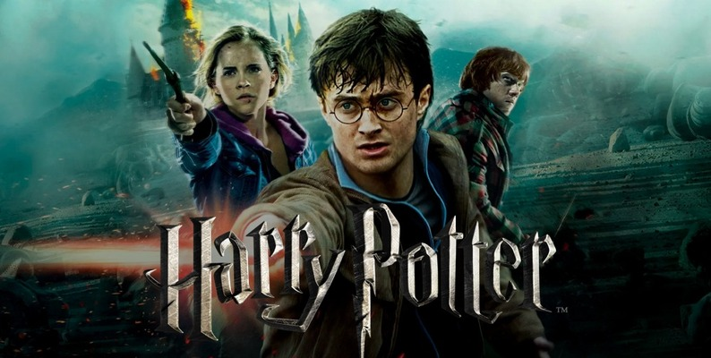

# harrypotter-textmining
2022/23 Text Mining project @ University of Milano-Bicocca

## Goal 
Our goal is to analyse harry potter's books doing text preprocessing, text representation, topic modeling, text summarization 

## Team
* Mirko Tritella (887196)
* Aurora Cerabolini (839327)
* Corinna Strada (839193)

## License
[MIT](https://choosealicense.com/licenses/mit/)
